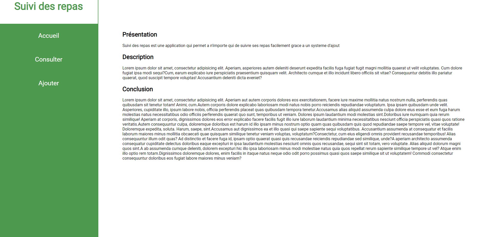
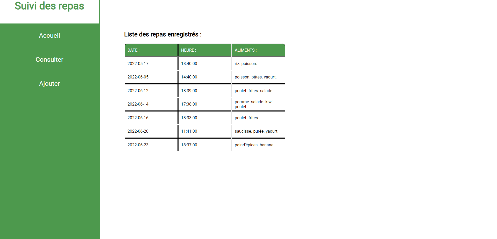
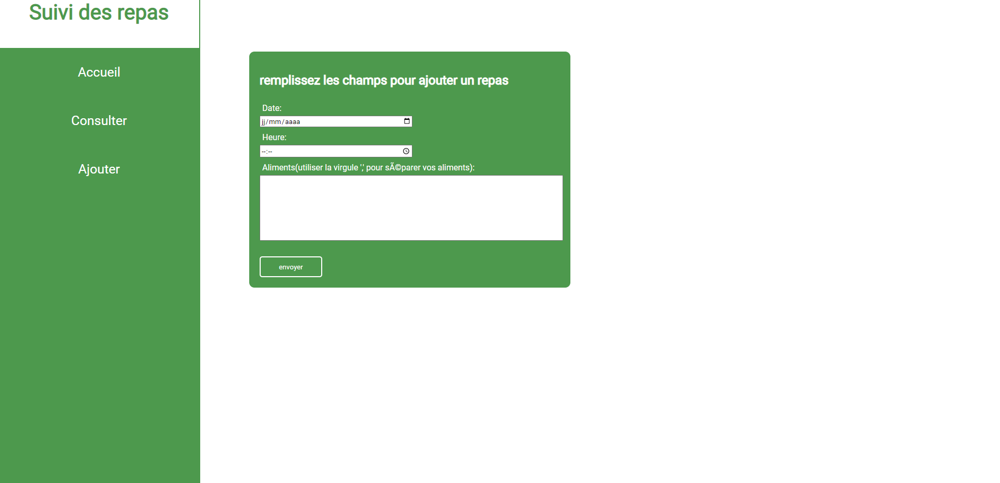

# WebApp de suivi des repas

lancer le script.txt dans une console mySQL pour creer la DB

## Accueil

Page d'accueil du site.

## Consulter

Page servant a consulter les repas que l'on a ajouter, les aliments déja
créés dans la bdd sont réutilisés grâce a un tableau d'association ce qui permet de ne pas surcharger la table des aliments.

## Ajouter

Le formulaire servant a ajouter les repas, la date doit être anterieur a la date du jour,
les aliments doivent être séparés par une virgule, les espaces suplémentaires sont retirés lors de l'intégration a la DB